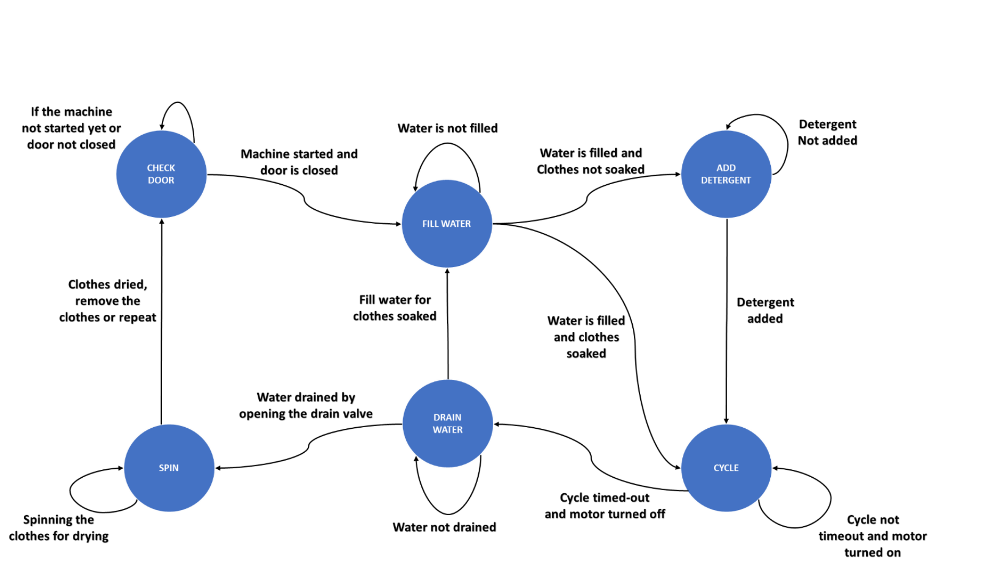
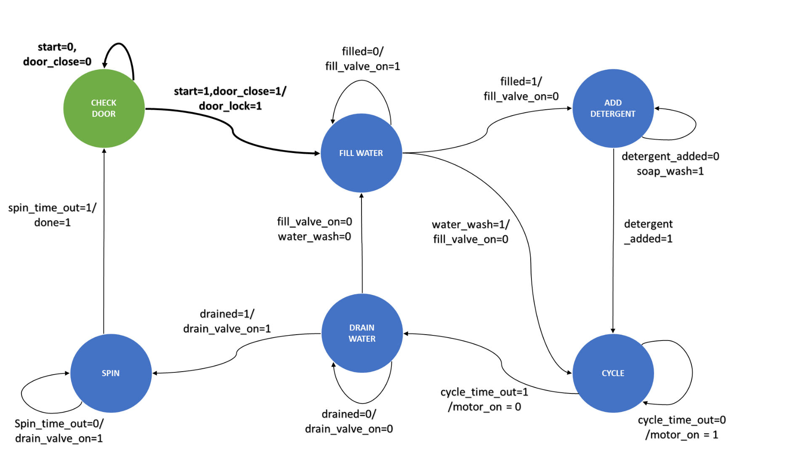

# Automatic Washing Machine Control System Using Verilog HDL

## Introduction

This project involves designing an automatic washing machine control system using Verilog HDL. The main stages of the washing process, such as closing the door, filling water, adding detergent, cycling, draining, and spinning, are implemented as a State Machine. This project utilizes Finite State Machines (FSM) to represent various real-life scenarios and includes a test bench to observe the working of the machine. The implementation is done using Xilinx ISE 14.7.

## Features

- **Finite State Machine**: Represents the main stages of the washing process.
- **Test Bench**: Allows observation and testing of the washing machine's working.
- **FPGA Implementation**: Demonstrates the code on FPGA.
- **Extendable**: The code serves as a basis for implementing additional features like different washing modes based on clothing material, temperature, etc.

## State Diagram

![State Diagram]

## Results

The automatic washing machine has been successfully implemented using Verilog HDL and Xilinx ISE. The project demonstrates the use of FSM in controlling the washing machine and can be extended to include more functionality.

       

## Future Scope and Applications

- **Different Modes**: Implementing different modes for washing based on clothing material, temperature, etc.
- **Enhanced Functionality**: Adding more features to improve the washing process.
- **Basis for Other FSM Projects**: The current project code can be used as a foundation for other projects based on FSM.

## Tools Used

- **Verilog HDL**
- **Xilinx ISE 14.7**

## Conclusion

This project showcases the implementation of an automatic washing machine control system using Verilog HDL. By utilizing FSM, the project effectively manages the various stages of the washing process. The successful implementation on FPGA and the potential for future enhancements make this project a valuable contribution to the field of control systems.

---

For more detailed information, please refer to the project documentation.

